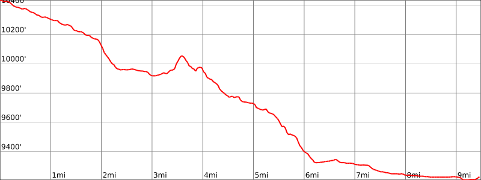
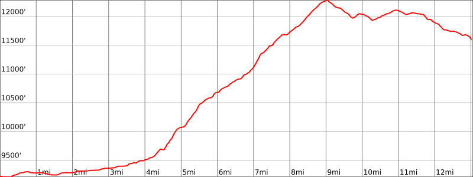
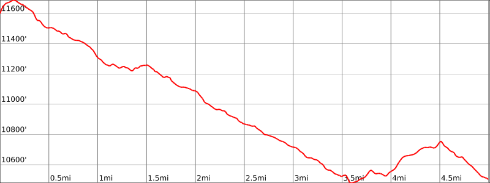

In December 2017, I was talking with a friend in Finland about hiking, and he mentioned that he had hiked something called the Fjällräven Classic in Sweden. He had a blast and recommended that I check out the USA edition of the event that would be held in Colorado in June 2018.

After reading horror stories about how quick the tickets for the Swedish event were selling out, I had my browser ready to go the minute the tickets became available. Score! I was ready to start planning. (Turned out that the tickets didn't sell out for several weeks. Better safe than sorry, though!)

Fjällräven announced that they will arrange the [Fjällräven Classic USA September 5-7](https://classic.fjallraven.com/usa/) in 2019.

## Preparations and route

Fjällräven had a lot of useful information posted on their website ahead of the hike. The [route page](https://classic.fjallraven.com/usa/classic-usa/the-route/) had an overview of the route, but not too much detail. Except for a detour to the first night's campsite, the route follows the Colorado Trail and CDT. The first and last days were quite short, with a more strenuous day in between.

You can see the route for the 2018 event on Caltopo below. From the looks of it, the same course will be used for the 2019 event, just with a shorter day 2.

<iframe width="100%" height="500px" src="https://caltopo.com/m/V457"></iframe>

Fjällräven published a [packing list](https://classic.fjallraven.com/usa/participate/packing-list/) to help those who are new to backpacking to remember everything essential. Coming from an ultralight backpacking background, some of the gear seemed pretty overkill for a two-night trip, especially a 65-75L pack.

I opted to pack based on my own research and gear I already had. I ended up with a base weight of around 13 lbs (that's everything in the backpack except water and food).

<figure>
  
  <figcaption>My gear all laid out. I even had a Fjällräven beanie!</figcaption>
</figure>

I flew into Denver and had pre-booked a shuttle to take me up to Copper Mountain. I arrived at Copper Mountain two days before the start to give me some time to acclimatize before the hike. I met two of the event organizers on the shuttle, it was fun to get to know them and get some insights before the event.

## Pre-hike activities

I spent the day before the actual hike exploring the area around Copper Mountain. I wanted to do a bit of fly fishing and hike a few miles to help me acclimatize.

<figure class="full-width">
  
  <figcaption>River outside Copper Mountain.</figcaption>
</figure>

The official signup and pre-party started in the afternoon. Fjällräven had set up a tent city below the ski slopes, with stalls for vendors and sponsors.

<figure>
  
  <figcaption>Pre-hike signup and party area.</figcaption>
</figure>

After signing up, I collected all my gear and swag for the hike:

- A trail guide and pass
- 100g gas canister
- Long-handled Primus spoon
- Grayl water filter
- Mora knife with flint
- Kuju Coffees
- Mountain house meals
- A bag for collecting trash out on the trail

Representatives from the US Forest Service, Leave No Trace, and the local Search and Rescue teams held presentations to inform people on proper outdoor etiquette and how to stay safe on the trail.

After the presentations, it was time to grab a beer and get to know my fellow hikers. There were people from all around the US and the world.

I happened to run into two guys speaking Swedish. We chatted for a while before heading off to our rooms. By chance, we all happened to meet up again at the bus the following morning and would end up hiking together for most of the trek.

## Day 1: Views, brews, and music

**9.5 miles. +300ft, -1,500ft gross elevation change.**

I woke up early to get on the first bus to the trailhead. The organizers had an arrangement with the resort that attendees could leave any extra luggage with the resort and have it delivered to their rooms when they finished the hike - super handy.

We arrived at the trailhead after a 45-minute bus ride, ready and eager to get started.

<figure>
  
  <figcaption>Heading out on the trail from Tennessee Pass.</figcaption>
</figure>

The first thing we needed to do was to get our passes stamped at the start checkpoint. We would need to get them stamped at each checkpoint to complete the event.

The trail started with a mellow downhill into a meadow. It felt great to be out on the trail. The weather couldn't have been better.

<figure>
  
  <figcaption>Trail down from Tennessee Pass.</figcaption>
</figure>

<figure class="full-width">
  
  <figcaption>Meadow around Mitchell Creek.</figcaption>
</figure>

At the end of the meadow, before a small climb, we came to the first checkpoint and surprisingly early lunch at 9 am. We opted to skip the soup. Instead, we grabbed some candy and sunscreen and continued on.

<figure>
  
  <figcaption>Brunch at Piney Gulch before the first climb.</figcaption>
</figure>

After climbing a relatively small hill, we came to a ledge overlooking Camp Hale and the Eagle River basin. Our first campsite was on the far side of the valley.

<figure>
  
  <figcaption>Camp Hale in the distance.</figcaption>
</figure>

Camp Hale had been a training facility for the US Army Mountain Division in the mid-1940s, and there were still some bunkers reminding us of what had been there. The roads were laid out in a city grid, although all the buildings had been torn down long ago.

<figure>
  
  <figcaption>Old bunkers at Camp Hale.</figcaption>
</figure>

Once we got down to the Camp Hale valley, we had a few miles down a dirt road to finish the first day. There were stalls serving kombucha, beef jerky, and ice cream along the way. There was so much food served on the first day that we were joking that it felt like the world's longest buffet table.

We arrived at camp around noon. We were given a bear canister and went on to set up our tents in the designated area between a few houses and a highway. Even though we were among the first ones there, we had a hard time finding flat spots for our tents.

<figure>
  
  <figcaption>There were almost no flat spots for setting up a tent.</figcaption>
</figure>

After a little searching, we all got our tents set up, and we went down to Eagle River to fish, swim, and take pictures. I caught a small brown trout and saw a few significantly bigger ones further up the river.

<figure>
  
  <figcaption>Fly fishing in the Eagle River.</figcaption>
</figure>

After fishing and refreshing ourselves in the river, we came back to the campsite. There was a beer tent set up serving beers from 10 barrel brewery. People were hanging out and enjoying the beautiful weather and scenery.

<figure>
  
  <figcaption>Burgers and hot dogs for dinner!</figcaption>
</figure>

The dinner consisted of burgers and hot dogs - a perfect pairing for the cold beer.

The designated camping area had filled up to capacity, so people started pitching their tents out on the lawn in front of the lake. The music, beer, and tent city made for an almost festival-like atmosphere.

<figure>
  
  <figcaption>A tent city appeared on the lawn.</figcaption>
</figure>

A band started playing a bit later in the evening, and we grilled marshmallows for smores. Not really the outdoor experience I had expected, but fun nonetheless.

<figure>
  
  <figcaption>Roasting marshmallows for smores.</figcaption>
</figure>

We retreated to our tents as the sunset. The second day was going to be much more demanding than the first, and we wanted to be well rested for it.

<figure class="full-width">
  
  <figcaption>An epic sunset to end the first day.</figcaption>
</figure>

## Day 2: Climbing above the treeline

**13 miles. +3,500ft, -1,100ft gross elevation change.**

We started the day early before the sun hit the valley floor. It was frigid, probably a few degrees over freezing. I really wished I hadn't ditched my gloves last minute.

Three miles into the hike, we came to the first checkpoint and breakfast. We wolfed down a few pancakes and sausages with a healthy serving of Nutella to fuel the climb up Kokomo pass.

After breakfast, the trail started climbing at a steady grade. The fresh morning air made the beginning of the climb pleasant. We filled up on water at a waterfall and continued on. I had downloaded the Guthook CDT map, which helped us get up to date info on water sources. This allowed us to carry less water and made for a more comfortable climb.

<figure>
  
  <figcaption>A waterfall on the climb up to Kokomo pass.</figcaption>
</figure>

As we climbed, the forest gave way to meadows and finally disappeared as we got above treeline.

<figure>
  
  <figcaption>Cataract Creek meadow.</figcaption>
</figure>

<figure>
  
  <figcaption>Heading up Kokomo Pass.</figcaption>
</figure>

It was a 5.5-mile steady climb from the breakfast checkpoint to the top. On our way up, we passed a few hikers struggling with huge 75+ liter packs.

Even if you don't want to go ultralight, I think it's a good idea to evaluate what you need on a two-night trip critically. With a big pack, it's easy to pack extra stuff "just in case," and then not enjoy the trail as you are too preoccupied trying to catch your breath or dealing with knee pain.

<figure class="full-width">
  
  <figcaption>Above treeline.</figcaption>
</figure>

On the other side of Kokomo Pass we entered a whole other world. We were now well above the tree line and could see for miles in each direction. The landscape was almost alien looking with different colors and patches of snow lingering from the winter.

<figure>
  
  <figcaption>Endless views.</figcaption>
</figure>

<figure>
  
  <figcaption>The highest point of the trail was at 12,286ft above sea level.</figcaption>
</figure>

We went over a second pass, Searle, before descending down to our second campsite. We could see the blue Fjällräven tents from a long distance and headed towards them to finish the second day.

We arrived at the campsite a little after 12pm. We were among the first there, so we could pick nice and flat campsites.

After setting up our tents, we went to fill up on water and made some lunch. Unlike the first campsite, the second camp was actual backcountry camping without any beer tents or burgers.

<figure>
  
  <figcaption>Hanging out at the second night's camp.</figcaption>
</figure>

Hikers were still coming in close to sunset around 8 pm. Many of the last hikers were showing signs of dehydration and altitude sickness. We helped some of the late arrivals set up their tents as the medical personnel was making sure that they were ok to stay out in the wilderness.

Fortunately, nobody had to be evacuated from the camp, and with some help from fellow hikers, everyone made it to the camp.

<figure class="full-width">
  
  <figcaption>The second night's camp had spectacular views.</figcaption>
</figure>

## Day 3: A stroll down to the after party

**5 miles. +500ft, -1,600ft gross elevation change.**

The last day was short compared to the two first days, only 5 miles and mostly downhill.

We had gone to bed early the night before, which meant we woke up pretty early even without an alarm. After breakfast and coffee, we were on the trail at 7 am.

The trail followed Guller Creek for the first few miles. The creek widened into marshy meadows glistening in the early morning sun.

<figure>
  
  <figcaption>Guller Creek Meadows after sunrise.</figcaption>
</figure>

There was only one checkpoint on the way down to the finish. We walked at a casual pace but ended up getting to the Trekker's Inn at the finish line around 9 am, before they had officially opened it. In hindsight, we could have spent more time at camp in the morning.

<figure>
  
  <figcaption>Finishing the hike at the Trekker's Inn.</figcaption>
</figure>

<figure>
  
  <figcaption>All checkpoints stamped and the patches to show for it!</figcaption>
</figure>

We relaxed in the sun, watching other hikers finish. A little later the party got started with grilled burgers and cold beer and kombucha on tap. We caught up with hikers we'd hung out with on the first night before heading down to Copper Mountain.

<figure>
  
  <figcaption>Burgers and beers at the after party.</figcaption>
</figure>

There were several small vans shuttling hikers down to the resort. We waited for a shuttle for a few minutes but then decided to hike the last 3 miles down.

All in all, it had been a fun adventure!

## Tips for the Fjälläven Classic

Are you considering to hike the Fjällräven Classic USA? Here are some tips to make the most of it.

**Don't pack too much**. Climbing in high altitude mountains is a lot more enjoyable with less weight on your back. You can do without camp shoes, camp chairs, and cots (yes, someone actually carried one). Plan your clothes so you can layer them for more/less warmth. If you can't wear every piece of clothing you have with you at once, you may be bringing more than you need.

**Train and acclimatize**. It's a good idea to get some trail miles in before the actual hike to ensure your shoes, gear, and legs work well. Get up to Copper Mountain a day early to allow your body to acclimatize.

**Stay hydrated**. The dry air and elevation make you lose a lot more moisture, just breathing than you are used to. Drink water and get electrolytes. And it's probably a good idea not to drink all the free beer on day 1. Kokomo pass can't be a fun experience with a hangover.

## Should you hike the Fjällräven Classic USA Colorado?

The Fjällräven Classic is a fun experience as long as you know what to expect, and it matches what you're looking for.

Fjällräven Classic is a great event for those who are new to backpacking. The organizers have done all the planning and support you throughout the entire trip.

The event is more of a social gathering for like-minded outdoorsy people than it is a wilderness experience. There won't be much solitude on the trail. Instead, you'll make new friends and get to enjoy good food, beer, and nature.

The Fjällräven Classic can also be a fun event for more experienced backpackers, offering a way to explore new trails and experiment with new gear as you have plenty of support from fellow hikers and personnel.

If you want to learn more, check out [Fjällräven Classic USA September 5-7, 2019](https://classic.fjallraven.com/usa/).
